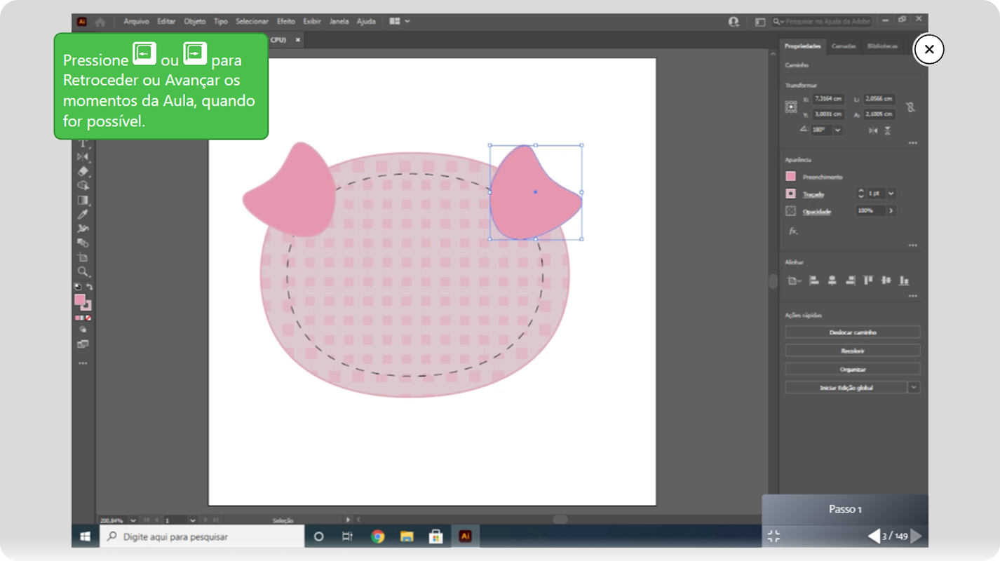

    
    Clone this repository and read the topics below to know how to use this Extension.

# How to use this extension?

To use this extension, from the code of this Repository, it is very simple. Just clone this repository by downloading it, then, in your Chromium browser, go to `chrome://extensions/` and then click on `Load Without Package` and then select the folder `Plugin-Para-Portal-Evolua` of this repository.
 

    <b>For normal use it's recommended that you download this Extension from the <a href="place_holder" target="_blank">Chrome Webstore</a>.</b>

# Extension Features

This extension aims to provide some useful features for the Brazilian professional courses portal, Portal Evolua. This extension can be downloaded and installed in the browser of any Evolua Portal user. Some of the features currently available are...

- Automatic reloading of the page when completing a stage of the lesson.
- Support for using the `->` and `<-` keys to navigate between lesson moments.

# Extension Compatibility

The extension is currently only compatible with `Chromium` based browsers and has been tested on the browsers below.

- Google Chrome
- Microsoft Edge Chromium

This extension, however, should work well on all other untested `Chromium` based browsers.
 
There are currently no plans to offer official compatibility with `Firefox`.

# Privacy/Security Notice

This extension does not collect any type of personal data from the user and neither stores nor sends them to other servers.

# Support projects like this

If you liked this Extension and found it useful for your projects, please consider making a donation (if possible). This would make it even more possible for me to create and continue to maintain projects like this, but if you cannot make a donation, it is still a pleasure for you to use it! Thanks! 😀

 

    

 

Created with ❤ by Marcos Tomaz

